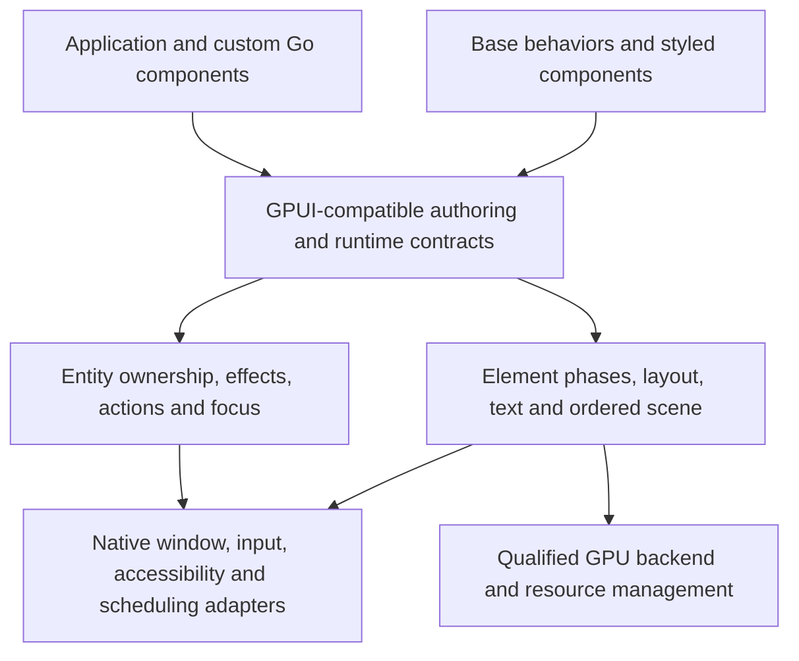

# Feasibility and recommended direction

Research date: 2026-10-04. This report synthesizes source inspection; it does not establish performance, production readiness, or an accepted design.

## Answer

A Go framework can preserve much of GPUI's fluent syntax and programming model. A faithful port is a substantial framework project: entity ownership, frame phases, dispatch, layout, text, rendering, and native integration all contribute observable behavior. Go does not remove that work. Whether it improves the user's development loop enough to justify maintenance remains a question for measurement.

Among the projects inspected, none was established as an existing faithful GPUI-CE Go port with a matching Base ecosystem. Gio, go-gui, Fyne, and newer Go GPU projects provide useful alternatives or building blocks, but their existence does not establish GPUI API or semantic compatibility. This is a bounded research finding, not an exhaustive claim about every repository. [Candidate audit](03-backend-text-layout-options.md), [discovery scope](07-sources-and-method.md).

## Findings that matter to the decision

### GPUI is more than its builder syntax

The inspected CE core separates persistent entities from temporary element recipes and uses request-layout, prepaint, and paint phases. Mutation and notification are separate operations. Notification coalescing differs from event delivery; ordinary event bubbling differs from action bubbling. Cached views retain dispatch, input, focus, and hit-testing information as well as scene output. These are compatibility requirements that a visually similar wrapper could miss. [Core source traces and conformance cases](01-gpui-core-contracts.md).

The costliest translation is likely ownership and lifecycle, rather than writing methods such as `Flex()` or `Child()`. Upstream behavior relies on prompt release of subscriptions, tasks, entity registrations, and overlay tokens. A Go port needs defined logical ownership and disposal even though memory is garbage collected. Finalizers or `runtime.AddCleanup` cannot supply deterministic release semantics. Scope-owned handles and explicit retain/release are candidate designs, with different ergonomics and safety costs. [Go lifetime analysis](04-go-api-and-lifetimes.md).

### Base should help define the core from the beginning

The user's linked [GPUI Base](https://gpui-kit.com/base/) is a useful compatibility corpus because its components exercise the framework's difficult behavior. Popovers depend on weak subscriptions and cleanup; dialogs depend on focus and action dispatch; inputs depend on composition and selection geometry. Virtual lists can construct and lay out visible subtrees during prepaint. A core that assumes the entire element tree is finished before layout would obstruct that port. [Base source audit](02-base-and-ecosystem.md).

Small controls also expose meaningful details. The inspected disabled Button blocks parent activation, while disabled Checkbox allows pointer events to bubble. Matching these controls requires a per-control behavioral reference, not only a shared disabled appearance. [Button test](https://github.com/longbridge/gpui-kit/blob/4c7f1350331562436df868c55ac33bebc4c6406c/crates/base/src/button.rs#L371), [Checkbox test](https://github.com/longbridge/gpui-kit/blob/4c7f1350331562436df868c55ac33bebc4c6406c/crates/base/src/checkbox.rs#L551).

There are two relevant upstream baselines. Original Kit pins `gpui-pre = 0.3.7`, a Zed snapshot family. The CE component fork instead depends on `gpui-ce = 0.2.2`. They share substantial code, but the three-file comparison performed here does not prove whole-library equivalence. The project must name a reference baseline or document a selected union. [Kit workspace](https://github.com/longbridge/gpui-kit/blob/4c7f1350331562436df868c55ac33bebc4c6406c/Cargo.toml), [CE component workspace](https://github.com/gpui-ce/gpui-component/blob/c08206932417f863062d2ab70cc2854c6ca04238/Cargo.toml).

### Go can retain recognizable syntax, with explicit adaptations

Chained styling is feasible. Preserving a custom component's concrete type after every common style method requires a deliberate solution; ordinary embedding does not rewrite method return types. Generated forwarding methods are a leading proposal, while a generic helper referencing the outer type deserves investigation. Neither has been implemented or selected.

The current Go 1.27 documentation supports generic methods, which improves the options for typed context/listener APIs. Generic methods still cannot implement interface methods. The installed Go 1.26.5 toolchain predates this feature, so the minimum Go version is an actual design choice. Third-party packages also cannot directly attach new methods to a core package's types. [Go 1.27 release notes](https://go.dev/doc/go1.27), [generic methods](https://go.dev/blog/generic-methods), [detailed API analysis](04-go-api-and-lifetimes.md).

### Reuse should follow the compatibility contracts

The recommendation is to own the GPUI model, element lifecycle, layout/style contracts, dispatch, and scene, while evaluating reusable dependencies beneath those boundaries. This revises the earlier broad recommendation to start with a Gio layer, which preceded the user's clarified port requirement.

Gio has useful renderer and window-host seams, including a custom-renderer mode, but its inspected public painting operations do not establish full coverage of GPUI's scene features. go-gui has relevant rendering work, but its renderer is coupled to its own application/window model. A custom GPUI scene renderer over a GPU abstraction is the stronger fit for fidelity, subject to backend qualification. [Backend audit](03-backend-text-layout-options.md).

GPU candidates differ materially: `gogpu/wgpu` contains a Go implementation, whereas `go-webgpu/webgpu` provides zero-cgo bindings to a Rust wgpu-native runtime. Avoiding a local Rust compiler and removing Rust from shipped binaries are separate goals. Text shaping libraries also do not supply a complete native input/editor system. The inspected Go layout alternative lacks requirements needed for a drop-in Taffy replacement; no ready-made Go binding to the exact reference Taffy version was verified. [Dependency and layout findings](03-backend-text-layout-options.md).

## Proposed architecture

This is a proposed separation of responsibilities, not a module specification. Base is a consumer and conformance probe of the same core used by application authors. Native platform needs may also surface through components, as the inspected Base input helper demonstrates.

## What would make this worth doing

The motivation should become measurable budgets for ordinary widget edits, shared-component edits, clean compilation, total development storage, and shipped artifacts. Compare equal application workloads and count caches and toolchains outside the project folder. Also track frame/input latency, idle work, allocations, and lifecycle correctness so a faster compiler does not conceal a runtime regression. No timing, disk-saving ratio, or runtime benchmark was measured here. [Measurement protocol](05-build-footprint-and-validation.md).

Before implementation, settle fidelity, upstream baseline, first platforms, permitted native dependencies, Go version, and ownership. Then select a small but demanding Base slice to validate the contracts. The existing [decision brief](06-decision-brief.md) and [Ask Matt handoff](../handoff/ask-matt.md) organize that discussion; they do not preselect the answers.
