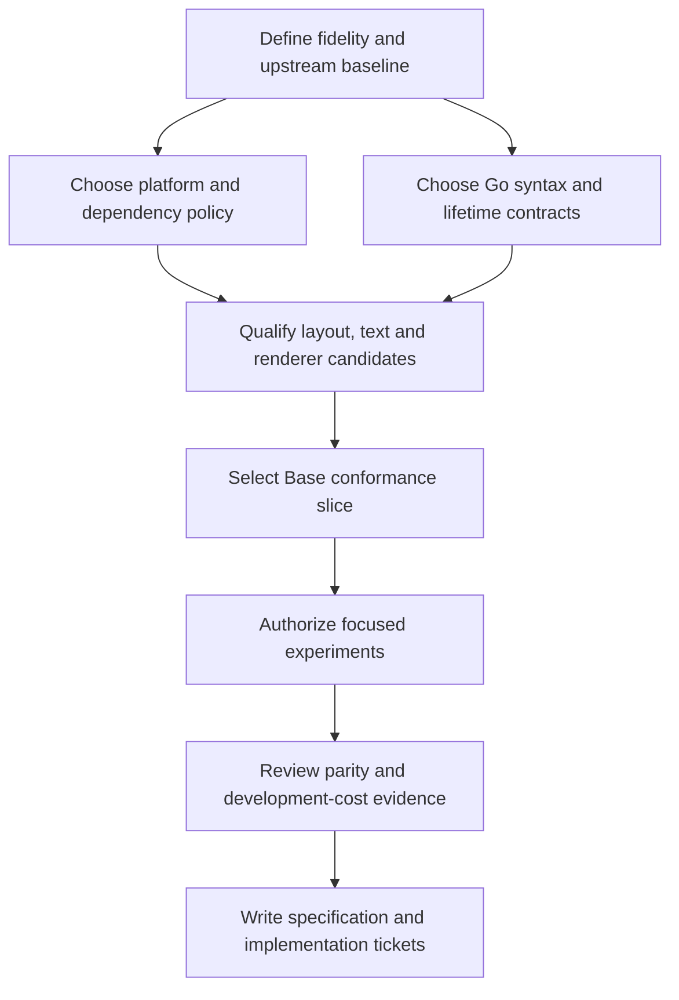

# Decision brief for the next flow

**Scope update from the Wayfinder discussion:** the user selected 1:1 parity with the Rust GPUI core as the first target. Base and other component libraries are deferred. The candidate questions below predate that clarification; library-baseline and first-Base-slice questions are later work, not blockers for the current core plan. [Current project brief](../PROJECT.md).

Status: research complete enough to start a structured decision process; the choices below remain open. This is a candidate decision map, not a tracker, accepted ADR collection, implementation spec, or promise of complete parity.

Read [CONTEXT](../CONTEXT.md) for confirmed user intent. The faithful-port requirement supersedes the earlier suggestion to adopt another Go toolkit's public interface.

## Destination to propose

A buildable specification for a Go port of GPUI with a defined compatibility baseline, agreed syntax adaptations, explicit lifetime semantics, selected first platform/backend strategy, and a Base component slice that demonstrates extensibility. The specification should make the build-time/disk-space objective measurable.

The user should confirm or change this destination in the next flow. Full ecosystem coverage and a first usable release are separate scopes.

## First decisions and dependencies

| Decision name | Precise question | Evidence available | What it unlocks |
|---|---|---|---|
| Define fidelity | Which syntax, behavior, visual output, platform integrations and upstream quirks must match? | Core and Base audits | All implementation scope and conformance criteria |
| Select upstream baseline | CE core + CE component fork, original GPUI Kit's Zed snapshot, or a documented selected union? | Exact dependency pins and fork source | Reference examples, conflict resolution, maintenance policy |
| Select first platforms | Which OS/architecture/display servers must work in the first usable release? | Backend matrix; Windows host is known | Native input, accessibility, renderer and packaging scope |
| Set the dependency policy | Must runtime internals all be Go, or is avoiding local Rust/C compilation sufficient? | Go/native GPU routes; proposed Taffy bridge | Feasible layout/rendering paths |
| Set language floor | Go 1.26-compatible functions/helpers, or Go 1.27 generic methods? | Local version and current official language docs | Typed Context/listener surface |
| Define lifetime ownership | Which scopes own entities, subscriptions, tasks and native resources? | Drop/weak/notification traces | Reliable events, async, caches and cleanup |
| Define fluent extensibility | How do custom components retain their concrete type after common styles? | Rust Self traits; Go method/embedding analysis | Base and third-party port ergonomics |
| Select layout strategy | Port Taffy behavior, use a native bridge, or accept a named subset? | Exact Taffy pin; alternative limitations | Layout contract, virtualization, text measurement |
| Select text/platform strategy | Which shaping/rasterization/IME/accessibility semantics must match on each platform? | go-text and platform code; Base input traces | Input/editor and accessibility scope |
| Select renderer/host | Which candidate can satisfy the chosen scene/input contract within dependency policy? | Scene audit and backend seams | First vertical compatibility experiment |
| Choose first Base slice | Which controls prove the core is usable for the user's intended applications? | Capability matrix and component dependencies | Tracer-bullet scope for later tickets |
| Define success budgets | What build/storage/latency improvement is worth maintaining a framework? | Unexecuted measurement protocol | Evidence-based go/no-go criteria |

Suggested order: fidelity and upstream baseline first; platform/dependency/language choices next; then lifetime/extensibility/layout/text contracts; then backend qualification and the Base slice. Several investigations can overlap, but a renderer choice should not silently settle the public model.

This diagram describes a proposed decision sequence. It does not authorize the experiment or implementation steps.

## Options that need user judgment

### Fidelity

Possible targets range from syntax/model familiarity, through behavior-equivalent application ports, to close visual parity on a defined platform. Literal source compatibility with Rust is impossible; direct use of Rust crates is a separate interop approach. Full pixel parity across all OS text stacks is a much stronger goal than preserving layout and interaction semantics.

The next interview should identify the GPUI behaviors the user most values using concrete examples: a typical view, a custom component, an input/editor, a popup, and a virtual list. Naming desired parity prevents a convenient backend from setting requirements by accident.

### Dependency policy

Separate three questions:

1. Is Go required for the application/component authoring experience?
2. Must ordinary developers avoid installing Rust/C toolchains?
3. Must the shipped framework contain no Rust/C native implementation at all?

The user's stated motivation establishes the first and motivates the second; it does not answer the third. A native layout or GPU artifact may meet development goals while failing a pure-Go-runtime preference. That is a decision, not a technical fact the researcher can infer.

### Ownership

Explicit owner scopes can provide deterministic disposal in Go, but are an adaptation to GPUI's reference-counted entity model. Explicit Retain/Release can mimic reference counting more closely but imposes more obligations on callers. GC-only disposal is incompatible with prompt cleanup contracts. The choice affects every higher-level control and must be documented before such controls are ported.

### Compatibility with the evolving ecosystem

GPUI-CE and GPUI Kit are independently moving sources. One version pair must be the reference; later updates need a deliberate intake process with changed-contract review and regression fixtures. A selected union of APIs should record which upstream wins in each conflict. Avoid maintaining an undocumented permanent promise to follow every upstream main branch.

## Recommended candidate Base slice

This is an engineering proposal for breadth of validation, not the user's accepted release scope:

| Slice | Contracts exercised |
|---|---|
| Button and checkbox | Fluent styles, disabled behavior, pointer/keyboard activation, controlled state |
| Input | Entity state, subscriptions, focus, text layout, selection, UTF-16 IME bridge, clipboard |
| Popover/dialog | Deferred/anchored painting, dismissal, occlusion, focus restoration, disposal |
| Virtual list | Prepaint-time subtree creation, layout measurement, retained identity, scrolling |
| Custom component from another package | Stable public extension surface and typed chaining |

A styled version of the same controls should share the Base behavior. Dock, editor, table, and motion are substantial follow-on capability groups; include them in the map, but avoid treating them as a handful of skinning tasks. See [ecosystem audit](02-base-and-ecosystem.md).

## Facts the agent can resolve without interviewing the user

Exact upstream pins and license files, callback ordering in source, current Go restrictions, platform dependency requirements, whether a candidate exposes a required GPU feature, and whether a source API is public. These belong in research tasks. User preferences should not be replaced by inferred defaults, and source facts should not be turned into unnecessary questions.

## Unknowns requiring execution later

- Whether a chosen fluent design gives useful compile errors and acceptable code-generation/compile cost.
- Actual layout/text differential parity for a selected implementation.
- Whether a candidate GPU backend runs the required shader feature set correctly across target drivers.
- Native IME and screen-reader correctness on real supported systems.
- Measured cold/warm build time, total disk use, allocations and frame/input latency.
- How much Base source can be translated mechanically versus redesigned around Go lifetimes.

These are proposed experiments in [validation](05-build-footprint-and-validation.md), not missing research claims to fill with estimates.

## Work intentionally left for later flows

No implementation tickets, external issues, selected tracker, project module, native bridge, generator, rendering demo, or accepted architecture decisions were created. The project root contains research and evidence. Once the user resolves the scope and contracts, `/to-spec` can produce a buildable plan and `/to-tickets` can divide it into independently reviewable work.
